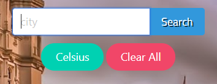
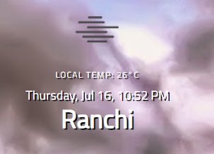

# Weather App On JS

[![Contributors][contributors-shield]][contributors-url]
[![Forks][forks-shield]][forks-url]
[![Stargazers][stars-shield]][stars-url]
[![Issues][issues-shield]][issues-url]

The Weather App project is build using Asynchronous Javascript and APIs call with async/await feature keeping in mind.

### Landing Page


### Weather Detail



### Toggle Between Fahrenheit/Celcius



### Not Found


## Live Demo

- [Production](https://rawcdn.githack.com/shubham14p3/weatherApp/feature/project/dist/index.html)

- [Deployment](https://raw.githack.com/shubham14p3/weatherApp/feature/project/dist/index.html)

## Built With

- HTML + CSS
- JavaScript
- API ()

## Getting Started

To get started with the app, cd to the directory where you would like the repo to live by typing on your terminal:

Clone the repo typing:

```
$git clone https://github.com/shubham14p3/weatherApp.git
```

Create .env file

```
OPEN_WEATHER_API_KEY='Your-API-KEY'
PIXABAY_API_KEY='Your-API-KEY'
(
	Note:
	1. The ENV file key should be placed without ''
	2. Signup at PIXABAY and OPEN WEATHER before and get the proper API keys to make the calls.
)
```

Run the following cammand

```
$npm install
```

```
$npm run build
```

```
Open Dist/index.html through live server
```

# User Interation UI

- User can toggle between Fahrenheit/Celcius
- Users can enter any valid location.
- Users can get live report.

## Authors

👤 **Shubham Raj**

- Github: [@ShubhamRaj](https://github.com/shubham14p3)
- Linkedin: [Shubham14p3](https://www.linkedin.com/in/shubham14p3/)

## 🤝 Contributing

Contributions, issues and feature requests are welcome!

Feel free to check the [issues page](https://github.com/shubham14p3/weatherApp/issues/).

## Show your support

Give a ⭐️ if you like this project!

## Acknowledgments

- Project requested by [Microverse Program](https://www.microverse.org/).

## Future Enhancement

- Adding More Validation.
- Making the Mobile friendly.

<!-- MARKDOWN LINKS & IMAGES -->

[contributors-shield]: https://img.shields.io/github/contributors/shubham14p3/weatherApp.svg?style=flat-square
[contributors-url]: https://github.com/shubham14p3/weatherApp/graphs/contributors
[forks-shield]: https://img.shields.io/github/forks/shubham14p3/weatherApp.svg?style=flat-square
[forks-url]: https://github.com/shubham14p3/weatherApp/network/members
[stars-shield]: https://img.shields.io/github/stars/shubham14p3/weatherApp.svg?style=flat-square
[stars-url]: https://github.com/shubham14p3/weatherApp/stargazers
[issues-shield]: https://img.shields.io/github/issues/shubham14p3/weatherApp.svg?style=flat-square
[issues-url]: https://github.com/shubham14p3/weatherApp/issues
